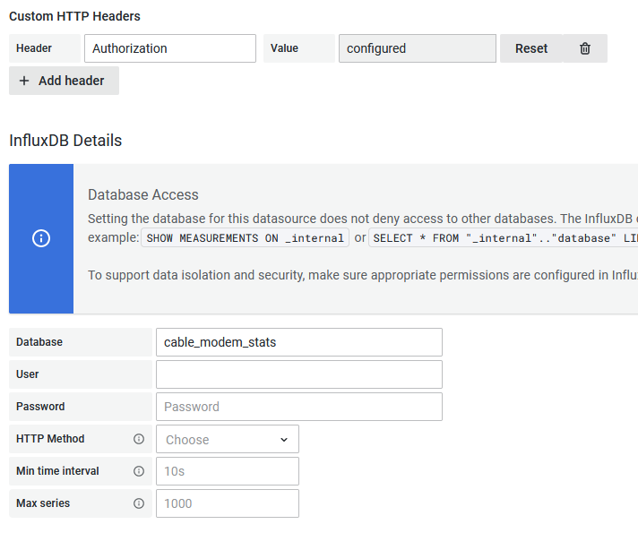
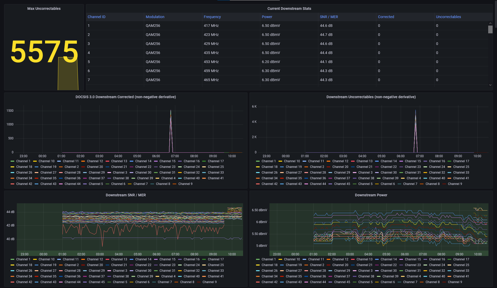
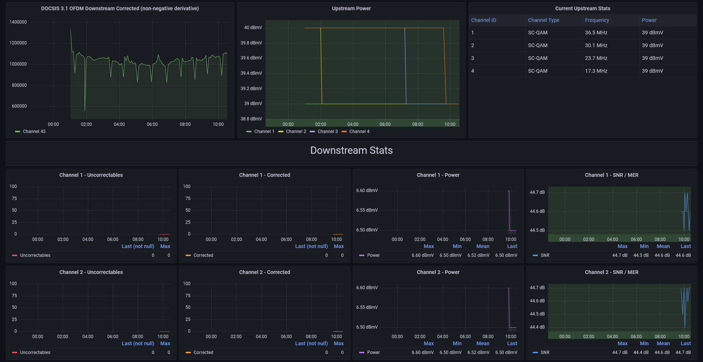

# Cable Modem Stats

This is a Python script to scrape stats from the Arris SB8200, Arris S33, and Comcast XB8 cable modem web interface. Results are meant to be sent to InfluxDB 2.x for use with Grafana, but other targets could be added.

This project is based off of:
- https://github.com/andrewfraley/arris_cable_modem_stats
- https://github.com/billimek/SB6183-stats-for-influxdb
- https://github.com/t-mart/ispee

## Basic Config Setup

### Comcast XB8

Set `modem_model` to `xb8`. There are no special config options for this modem. Set `modem_password` in the config with your modem password.

### S33

Set `modem_model` to `s33` (currently the default). There are no special config options for this modem. Set `modem_password` in the config with your modem password.

### SB8200

If modem uses SSL, set `modem_ssl` to true.

#### Oct. 2020

In late Oct 2020, Comcast deployed firmware updates to the SB8200 which now require authenticating against the modem. If your modem requires authentication (you get a login page when browsing to https://192.168.100.1/), then you must edit your config.ini file (or set the matching ENV variables) and set `modem_auth_required` to `True`, and set `modem_password` appropriately. By default, your modem's password is the last eight characters of the serial number, located on a sticker on the bottom of the modem.

There is some kind of bug (at least with Comcast's firmware) where the modem cannot handle more than ~10 sessions. Once those sessions have been used up, it seems you must wait for them to expire or reboot the modem. I have not been able to successfully log out of the sessions, but this script attempts to keep reusing the same session as long as it can.

#### Sept. 2021

In Sept 2021, Comcast deployed another firmware which changed the login flow. If you have firmware version `AB01.02.053.05_051921_193.0A.NSH` or higher, please set `modem_new_auth` to `True`.

This version seems to fix the ~10 session limit from the Oct. 2020 fimware. The `sleep_interval` has been reduced from `300` to `120`.

## Docker
Docker Compose file

```bash
version: '3'

services:
  arris_stats:
    image: ghcr.io/sarabveer/arris_cable_modem_stats:latest
    container_name: arris_stats
    restart: unless-stopped
    network_mode: host
    environment:
      - modem_password=PutPasswordHere
```

Note that the same parameters from config.ini can be set as environment variables. The environment variables override anything set in config.ini.

## Run Locally

- Install the latest Python 3
- Clone repo
- Change directory
  - `$ cd cable-modem-stats`

- Install virtualenv
  - `$ python3 -m pip install virtualenv`

- Create and activate virtualenv
  - `$ python3 -m venv venv`
  - `$ source venv/bin/activate`

- Install pip dependencies
  - `python3 -m pip install -r src/requirements.txt`

- Edit config.ini and set the approriate settings

- If your cable modem requires authentication, edit config.ini and set:
  - `modem_password = <your-password>`
  - Check [Authentication](#authentication) for specific options for your modem model

- Run arris_stats.py
  - `python3 src --config config.ini`

## Special Config Settings

Config settings can be provided by the config.ini file, or set as environment variables. Environment variables override config.ini. This is useful when running in a Docker container.

| Option | Default | Notes |
| ------------ | ------------ | ------------ |
| `modem_model` | s33 | Pick either `s33`, `sb8200`, or `xb8` |
| `exit_on_auth_error` | `True` | Any auth error will cause an exit, useful when running in a Docker container to get a new session |
| `exit_on_html_error` | `True` | Any error retrieving tdata will cause an exit, mostly redundant with exit_on_auth_error |
| `clear_auth_token_on_html_error` | `True` | This is useful if you don't want to exit, but do want to get a new session if/when getting the stats fails |
| `sleep_before_exit` | `True` | If you want to sleep before exiting on errors, useful for Docker container when you have `restart = always` |

### InfluxDB Config

| Option              | Default                 | Notes                                       |
|---------------------|-------------------------|---------------------------------------------|
| `influx_url`        | `http://localhost:8086` | InfluxDB URL                                |
| `influx_bucket`     | `cable_modem_stats`     | DBRP Name                           |
| `influx_org`        |                         | Org ID                                      |
| `influx_token`      |                         | Token                                       |
| `influx_verify_ssl` | `True`                  | Verify SSL cert when connecting to InfluxDB |

### Debugging

You can enable debug logs in three ways:

1. Use --debug when running from cli
  - `pipenv run python3 src --debug --config config.ini`
2. Set ENV variable `arris_stats_debug = true` or config.ini `enable_debug = true`

## InfluxDB

The Grafana dashboard uses InfluxQL, so a DBRP mapping needs to be made:

```bash
influx v1 dbrp create \
  --db cable_modem_stats \
  --rp cable_modem_stats \
  --bucket-id <bucket-id> \
  --default
```

Replace `<bucket-id>` with the ID of the `cable_modem_stats` bucket created in InfluxDB 2.x

Read more about this [here](https://docs.influxdata.com/influxdb/v2.0/query-data/influxql/)

## Grafana

In order to add the InfluxDB data source to Grafana, a DBRP has to be created (as shown above), and then the data source has to be setup as shown below:



The `Authorization` header has to be in format: `Token <your-token-here>`

Read more about this [here](https://github.com/grafana/grafana/issues/29372#issuecomment-733717988).

### Arris SB8200 Dashboard

- Setup arrris_stats.py to run from somewhere
- Import a new dashboard using the [grafana/sb8200_grafana.json](grafana/sb8200_grafana.json) file. Originally exported from Grafana v8.0.5



